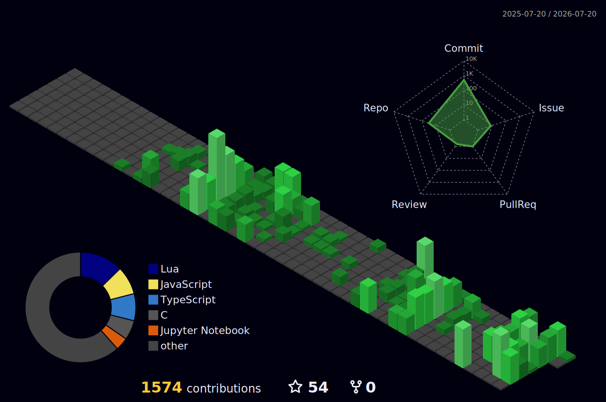

<!--START_SECTION:waka-->


📊 **This Week I Spent My Time On** 

```text
💬 Programming Languages: 
JavaScript               1 hr 9 mins         █████░░░░░░░░░░░░░░░░░░░░   20.51 % 
Other                    53 mins             ████░░░░░░░░░░░░░░░░░░░░░   15.84 % 
Lua                      44 mins             ███░░░░░░░░░░░░░░░░░░░░░░   13.26 % 
YAML                     33 mins             ██░░░░░░░░░░░░░░░░░░░░░░░   09.83 % 
HTML                     29 mins             ██░░░░░░░░░░░░░░░░░░░░░░░   08.90 % 

🔥 Editors: 
VS Code                  3 hrs 58 mins       ██████████████████░░░░░░░   70.82 % 
Neovim                   1 hr 38 mins        ███████░░░░░░░░░░░░░░░░░░   29.18 % 

🐱‍💻 Projects: 
hackathon                1 hr 26 mins        ██████░░░░░░░░░░░░░░░░░░░   25.80 % 
coding                   1 hr 2 mins         █████░░░░░░░░░░░░░░░░░░░░   18.50 % 
Unknown Project          1 hr 2 mins         █████░░░░░░░░░░░░░░░░░░░░   18.49 % 
portfolio                56 mins             ████░░░░░░░░░░░░░░░░░░░░░   16.89 % 
unishare                 34 mins             ███░░░░░░░░░░░░░░░░░░░░░░   10.33 % 

💻 Operating System: 
Linux                    5 hrs 36 mins       █████████████████████████   100.00 % 
```


 Last Updated on 01/05/2026 04:55:52 UTC
<!--END_SECTION:waka-->


